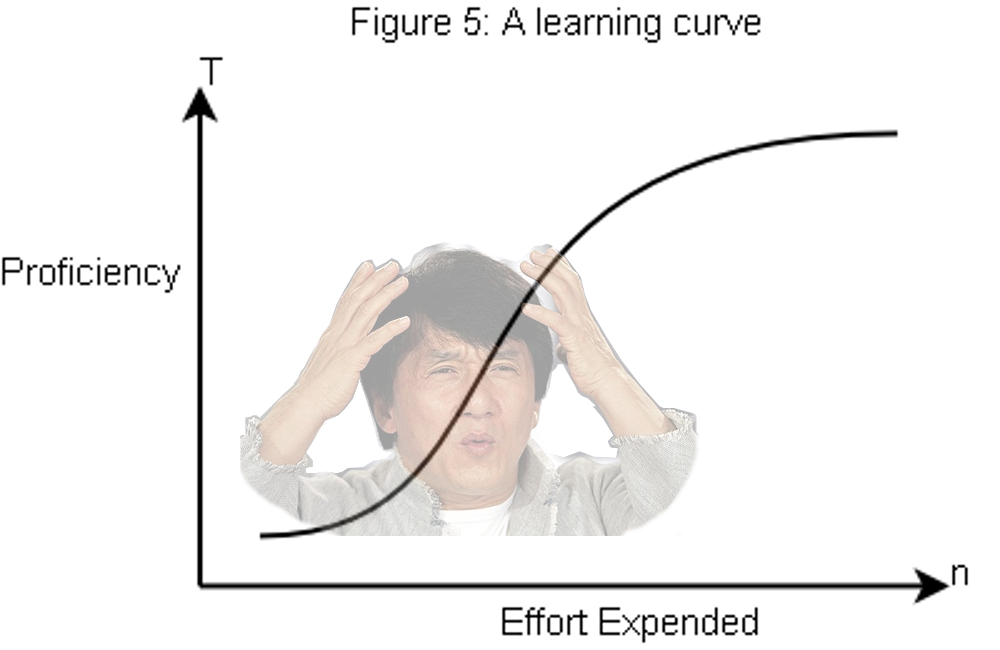

Introduction to Reactive Programming
---
What does _reactive_ mean?
---

Means many things to many people.

There is even a **Reactive Manifesto** which defines *Reactive Systems* as the following:

>Systems that are Responsive, Resilient, Elastic and Message Driven.

##### Responsive
 Responsiveness means any request is _almost_ always handled in a timely manner. 
 
 This is the cornerstone of usability and utility. 
 Even more than that, responsiveness allows for problems to be detected quickly and dealt with effectively. 
 
 Responsive systems focus on providing rapid and reply times that remain consistent.
 So that the bar for quality remains high in consistently delivering quality service. 
 
 This consistent behaviour in turn simplifies error handling, builds end-user confidence, and encourages further interaction.
  
###### Resilient
   Goes hand in hand with *Responsiveness*, in that system always replies, even in the face of failure. 
   Any system that is not resilient will be unresponsive after a failure including systems that are highly-available or mission-critical. 
   Resilience is achieved by replication, containment, isolation and delegation. 
   
   Failures are contained within each component, isolating components from each other and thereby ensuring that parts of the system can fail and recover without compromising the system as a whole. 
   Recovery of each component is delegated to another (external) component and high-availability is ensured by replication where necessary. 
   The client of a component is not burdened with handling its failures.

###### Elastic
 
 The system stays remains consistent under varying workload. 
 Reacting to changes in the input rate by increasing or decreasing the resources allocated, in order to service these inputs.
  
 This implies designs that have no contention points or central bottlenecks.
 Which results in the ability to shard or replicate components and distribute inputs among them. 
 
 Reactive Systems support predictive, as well as Reactive, scaling algorithms by providing relevant live performance measures. 
 They achieve elasticity in a cost-effective way on commodity hardware and software platforms.
 
###### Message Driven: 

Reactive Systems rely on asynchronous message-passing to establish a boundary between components. 
Which ensures loose coupling, isolation, and location transparency. 

This boundary also that failures can be propagated and delegated as messages. 
Employing explicit message-passing enables load management, elasticity, and flow control from shaping and monitoring the message queues in the system and applying _back-pressure_ when necessary.
 
Transparent location messaging, as a means of communication, enables the management of failure to work across a cluster or within a single host with the same constructs and semantics . 
Non-blocking communication allows recipients to only consume resources while active, leading to less system overhead.

Project Reactor defines it as:

>An asynchronous programming paradigm concerned with data streams and the propagation of change. This means that it becomes possible to express static (e.g. arrays) or dynamic (e.g. event emitters) data streams with ease via the employed programming language(s).

The folks over at spring say:

>Refers to programming models that are built around reacting to change: network component reacting to I/O events, UI controller reacting to mouse events, etc. 
In that sense, non-blocking is reactive because instead of being blocked we are now in the mode of reacting to notifications as operations complete or data becomes available.

-----

Handling streams of data—especially “live” data whose volume is not predetermined—requires special care in an asynchronous system. 
The most prominent issue is that resource consumption needs to be controlled such that, a fast data source does not overwhelm the stream destination. 

The main goal of Reactive Streams is to govern the exchange of stream data across an asynchronous boundary—think passing elements on to another thread or thread-pool.
While ensuring that the receiving side is not forced to buffer arbitrary amounts of data.

Who?
---

Why?
---

Modern applications have the ability to reach huge numbers of concurrent users.
Even though the capabilities of modern hardware have continued to improve,
 performance of modern software is still a key concern.
 
There are at least two general programming paradigms that can improve a program’s performance:

1. parallelize: use more threads and more hardware resources.
1. seek more efficiency in how current resources are used.

**Multi-Threading**, is this how I get the most bang for the buck?

Java developers have the ability to easily write programs using blocking code.
This practice is fine until there is a performance bottleneck arises.
A solution would be to introduce even more threads threads, running similar blocking code.
Scaling in resource utilization can quickly introduce thread contention and concurrency problems.

Worse still, all of those new threads are just sitting there blocking and wasting resources that could be used to do work. 
If you look closely, as soon as a program involves some latency 
(notably I/O, such as a database request or a network call), resources are wasted as a thread (or many threads) now are sitting idle, waiting for responses.

The CPU can only do so many things at once, and adding more threads exacerbates the problem.

When a thread is blocked, no work is being done by that thread. 
It will eventually have to be put back into context, so that it may be worked.
If another thread is added, to work on a similar process, eventually that thread is going to block as well.
It too, will be waiting, have to be put back into context and get some CPU time.
There is a point where spawning more threads to work, the less efficient the tasks come come to be processed.

The OS scheduler, is going to let a thread get N amount of clock time, and then it is going to context switch (which can add up as more things need to be process).
Which involves moving things out of the direct memory cache, loading up next context of the thread and then trying to process a threads work.

The more threads that are in need of being processed, the more the context switching needs to happen.
As more and more threads spin up, there is point where **thrashing** occurs. 
Which means that all work being done for the all of the clock cycles is just setting up thread context, not doing any work (no time), and tearing down for the next thread to be processed.

So the parallelization approach is not a silver bullet. 
However, it is necessary in order to harness the full power of the hardware.

Large number of performance bottle-necks, as mentioned above, occur when processes are waiting for input and output I/O. 
Whether it be a network call, reading from disk, or even a database query. 

There is a way to reach the past the point of diminishing returns when introducing concurrency and throwing more threads at a problem.

The biggest bang for our buck would be having a few active threads that are always doing work. 
Never blocking and always reacting to work that needs to be done.

How?
---

This can be done by utilizing a **Non-Blocking** programming paradigm. 

A **pull-based** call says, `Hey, you cannot continue down the rest of this code until this one thing happens.`.
Which essentially _blocks_ the program's flow until it can continue to be processed.
Where as **push-based** system does not necessarily need to block work from happening. 
When data is processed in time, then it will be directed to where it needs to go. Don't call us, we'll call you.

The reactive programming paradigm is often presented in object-oriented languages as an 
extension of the Observer design pattern.

One can also compare the main reactive streams pattern with the familiar Iterator design pattern. 
There is a duality to the Iterable-Iterator pair and Reactive Streams. 

One major difference is that, an Iterator is **pull-based**, reactive streams are **push-based**.
Using an iterator is an imperative programming pattern, 
even though the method of accessing values is solely the responsibility of the Iterable.

Indeed, it is up to the developer to choose when to access the `next()` item in the sequence. 
In reactive streams, the equivalent of the above pair is **Publisher-Subscriber**. 
It is the `Publisher` that notifies the `Subscriber` of any newly available values as they come. 
The push aspect of this paradigm is the key to being reactive. 

Also, operations applied to pushed values are expressed declaratively rather than imperatively: 
the programmer expresses the logic of the computation rather than describing its exact control flow.

In addition to pushing values, the error handling and completion aspects are also covered in a well defined manner. 
A Publisher can push new values to its Subscriber, but can also signal an error, or completion. 
Both errors and completion terminate the sequence of events created from the publisher.

Rather than blocking to wait for a method to return, just have the data sent over once it is ready.
That way work can be done while that data is getting ready to be processed.

**Push-Based** programming lends itself to asynchrony.
Which is needed in order to enable the efficient parallel use of computing resources. Whether they be  collaborating network hosts or multiple CPU cores within a single machine.
 
Remember thread contention? Having multiple threads compete for shared resources is a bit of a pain, especially when you want to add more threads!
Issues with thread contention in non blocking code is minimal. As most of the code is processed inside of a **event loop**

Wikipedia is nice and gives a handy definition of an event loop:

>The event loop, message dispatcher, message loop, message pump, or run loop is a programming construct that waits for and dispatches events or messages in a program. 
It works by making a request to some internal or external "event provider" (that generally blocks the request until an event has arrived), and then it calls the relevant event handler ("dispatches the event")

The reactor design pattern is an event handling pattern for handling service requests delivered concurrently to a service handler by one or more inputs. 
The service handler then demultiplexes the incoming requests and dispatches them synchronously to the associated request handlers.

The term Actor is also another term to be familiar with.
An actor is a computational entity that, in response to a message it receives, can concurrently:

- send a finite number of messages to other actors;
- create a finite number of new actors;
- designate the behavior to be used for the next message it receives.

Having a few a event loop threads that do not block and are always processing work is the key to reaching maximum efficiency.

Which should explain _why_ spring states that they created the WebFlux library.

 >Part of the answer is the need for a non-blocking web stack to handle concurrency with a small number of threads and scale with less hardware resources. 
 Servlet 3.1 did provide an API for non-blocking I/O. 
 However, using it leads away from the rest of the Servlet API where contracts are synchronous (Filter, Servlet) or blocking (getParameter, getPart). 
 This was the motivation for a new common API to serve as a foundation across any non-blocking runtime. 
 That is important because of servers such as Netty that are well established in the async, non-blocking space.
 
 >The other part of the answer is functional programming. 
 Much like the addition of annotations in Java 5 created opportunities — e.g. annotated REST controllers or unit tests, the addition of lambda expressions in Java 8 created opportunities for functional APIs in Java. 
 This is really helpful for non-blocking applications and continuation style APIs — as popularized by CompletableFuture and ReactiveX, that allow declarative composition of asynchronous logic. 
 At the programming model level Java 8 enabled Spring WebFlux to offer functional web endpoints alongside with annotated controllers.
 
 >There is also another important mechanism that we on the Spring team associate with "reactive" and that is non-blocking back pressure. 
 In synchronous, imperative code, blocking calls serve as a natural form of back pressure that forces the caller to wait. 
 In non-blocking code it becomes important to control the rate of events so that a fast producer does not overwhelm its destination.
 
### Moving from synchronous Imperative to asynchronous Reactive Programming

Granted there is a bit of a learning curve to adopting non-blocking, functional, and declarative programming.

It requires a different mindset compared to imperative programming.

I like to think of imperative programming as rolling a ball to it's destination.
Where the actual program is controlling the actions of the ball. 
Where the ball is actually controlled by the one who wants it to be in specific place.

Where as reactive programming is like having to roll a ball down a hill to get where it needs to go.
If you want the ball to go where you want it, you have to set up walls and obstacles to guide it.
Once the ball reaches that part of the hill, the ball interfaces with the construct and continues in the direction the construct leaves it.

Replace ball with data, and it is almost the same thing. 
Reactive programming, is about setting up sequences that manipulate data as it flows. When it flows is up in the air at run time.
The best we can do is set up our functions (constructs) that manipulate the data as it flows through the sequences we build. 

Reactive streams are very much like the Java 8 stream API.

Here are some of the characteristics of reactive streams:

- Data as a flow, is manipulated with a rich vocabulary of operators
- Nothing happens until you subscribe
- _Backpressure_: which is the ability for the consumer to signal the producer that the rate of emission is too high (buffering)
- High level and a high value abstraction that is concurrency-agnostic

##### Types of Sequences 

In the Rx family of reactive libraries,
 one can distinguish two broad categories of reactive sequences: **hot** and **cold**.
This distinction mainly has to do with how the reactive stream reacts to subscribers:

- **Cold Sequences**: starts anew for each Subscriber, including at the source of data. 
Every subscriber will see the entire sequence.
 If the source wraps an HTTP call, a new HTTP request is made for each subscription. 
- **Hot sequences**: do not start from from the beginning for every Subscriber.
 Rather, late subscribers receive only signals emitted after they subscribed. 
 If a publisher was already producing, then the subscriber would only see the items currently being produced after subscription. 
 >Note, however, that some hot reactive streams can cache or replay the history of emissions totally or partially. 
 From a general perspective, a hot sequence can even emit when no subscriber is listening
  (an exception to the "nothing happens before you subscribe" rule).

Sources
---

- http://projectreactor.io/docs/core/release/reference/
- https://vertx.io/docs/guide-for-java-devs/guide-for-java-devs.pdf
- http://netty.io/wiki/user-guide-for-4.x.html
- https://en.wikipedia.org/wiki/Event_loop
- https://en.wikipedia.org/wiki/Actor_model
- https://en.wikipedia.org/wiki/Reactor_pattern
- https://docs.spring.io/spring/docs/current/spring-framework-reference/web-reactive.html
- https://github.com/reactor/reactor
- https://github.com/reactive-streams/reactive-streams-jvm/blob/v1.0.2/README.md